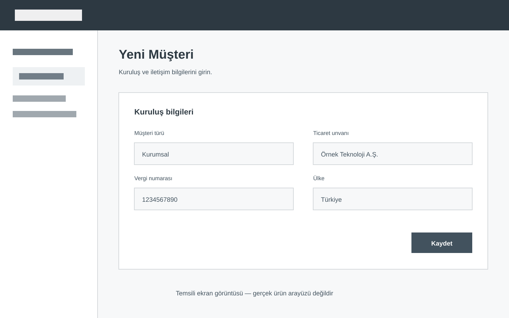

# İçerik Bileşenleri

Bu katalog, mevcut yapılandırmayla bir rehber sayfasında kullanılabilen içerik parçalarını gösterir. Amaç bütün parçaları her sayfada kullanmak değil, ihtiyaç olduğunda hangi seçeneklerin hazır olduğunu görmektir.

## Başlıklar

Sayfada yalnız bir ana başlık kullanılır. Ana işlemler ikinci seviye, bir işlemin alt ayrımları üçüncü seviye başlıklarla anlatılır.

### Üçüncü seviye başlık örneği

Bu başlık, aynı işlem içindeki kısa bir alt konuyu ayırmak için kullanılabilir.

## Paragraf ve metin vurguları

Normal paragraf, rehberin temel anlatım biçimidir. Metin içinde **önemli bir kontrol**, *kısa bir vurgu* veya `MUS-00125` gibi sistemde görülen sabit bir değer belirtilebilir.

Vurgu yalnız gerçekten ayırt edilmesi gereken kelimelerde kullanılmalıdır. Bir paragrafın tamamı kalın yazılmamalıdır.

## Bağlantılar

- [Site içindeki başka bir rehbere gidin](../akademi/egitime-kayit-olma.md).
- [TÖDEB internet sitesini açın](https://todeb.org.tr/).

Bağlantı metni, kullanıcıya açılacak hedefi söylemelidir. “Buraya tıklayın” gibi hedefsiz ifadeler kullanılmamalıdır.

## Bilgi notu

> **Başlamadan önce:** Bu işlem yalnız gerekli kullanıcı yetkisine sahip hesaplarda tamamlanabilir.

Mevcut sistemde bilgi ve uyarı notları sade bir alıntı bloğu ile gösterilir. Ayrı renk ve ikon seçimi bulunmaz.

## Madde listesi

- Zorunlu bilgileri hazırlayın.
- Kayıt sahibini doğrulayın.
- İşlem sonucunu kontrol edin.
    - Ekrandaki bildirimi okuyun.
    - Gerekirse e-posta kutusunu kontrol edin.

Madde listeleri sırası önemli olmayan kısa bilgiler için kullanılır.

## Numaralı işlem adımları

1. **İşlemin yapılacağı sayfayı açın.**  
   Kullanıcının izleyeceği menü yolunu açıkça belirtin.

2. **İlgili kontrolü seçin.**  
   Kontrolün ekrandaki görünen adını kalın yazın.

3. **Sonucu doğrulayın.**  
   Kullanıcının işlemin tamamlandığını nasıl anlayacağını açıklayın.

Numaralı liste yalnız belirli bir sırayla tamamlanması gereken işlemlerde kullanılır.

## Görsel ve açıklaması

*Görselin altında ekranda ne gösterildiğini anlatan kısa bir açıklama bulunabilir.*

Görseller içerik genişliğini aşmaz. Aynı ekranın gereksiz tekrarlarından kaçınılır.

## Video alanı

  <video controls preload="metadata" playsinline>
    <source src="https://files.gitbook.com/v0/b/gitbook-x-prod.appspot.com/o/spaces%2FLBGJKQic7BQYBXmVSjy0%2Fuploads%2FvtrSGbLGw97w6RDsWuXE%2Fupload-embed-video.mp4?alt=media&amp;token=8890e68a-cfcb-4ccf-872e-77aa526d87fb" type="video/mp4">
    Tarayıcınız video oynatmayı desteklemiyor.
  </video>

Bu doğrudan video alanı mevcut prototip davranışını gösterir. YouTube alanının nihai davranışı sonraki adımda ayrıca belirlenecektir.

## Kod ve sabit değerler

Kısa değerler cümle içinde `MUS-00125` biçiminde gösterilebilir. Birden fazla satırlı örnek gerektiğinde girintili kod bloğu kullanılabilir:

    Müşteri kodu: MUS-00125
    Kayıt durumu: Aktif
    Kaynak: Manuel kayıt

Bu alan yazılım kodu göstermek zorunda değildir; kullanıcı tarafından aynen görülmesi veya girilmesi gereken metinler için de kullanılabilir.

## Yatay ayırıcı

Yatay çizgi, birbirinden bağımsız iki büyük içerik grubunu ayırmak için kullanılabilir.

---

Ayırıcı, her başlığın altında tekrarlanan dekoratif bir öğe olarak kullanılmamalıdır.

## Şu an aktif olmayan yapılar

Aşağıdaki yapılar mevcut Markdown standardının parçası değildir:

- Açılır kapanır içerik alanları
- Sekmeli içerikler
- Kart ve grid düzenleri
- Özel işlem butonları
- Tablo
- Renk veya ikon seçilebilen uyarı kutuları
- Otomatik numaralı adım kartları
- YouTube için tıklayınca yüklenen özel video alanı

Bu yapılardan biri gerçek içerikte tekrar eden bir ihtiyaca dönüşürse ayrıca değerlendirilir. Tek bir sayfa için mevcut standarda sessizce eklenmez.
